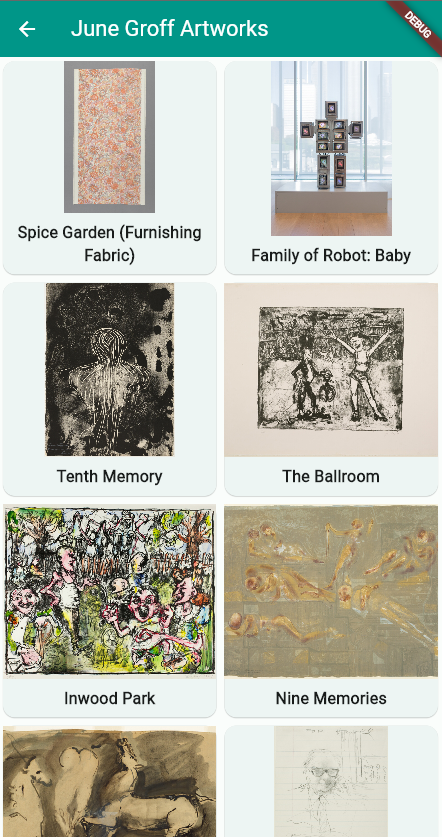

# Art App

In this Dojo, a simple application consisting of two screens will be developed. One is a screen with
a list of artists, and the second is a screen with images of the artist's works. An API will be used
to obtain information about different artists and their works.

|||
|--|--|

